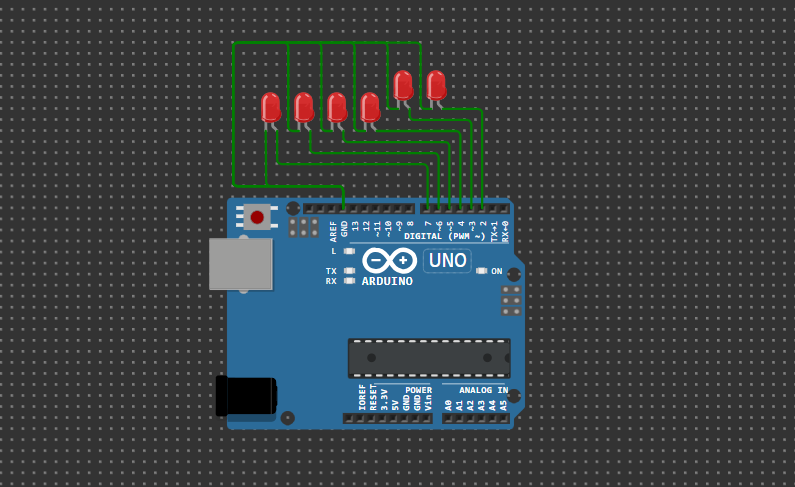

# 🔦 ArduinoChasingLight

### 🎇 30+ Dynamic LED Animations with Arduino Uno

Bring your LEDs to life with this fun and visually engaging Arduino project!  
`ArduinoChasingLight` is a high-performance sketch that features **30+ unique LED animations** using just **6 LEDs** and an **Arduino Uno**. Whether you're exploring embedded systems, learning microcontroller basics, or enhancing your decorative lighting setups, this project is perfect for makers and enthusiasts alike.

---

## ✨ Features

- 30+ pre-programmed LED animation effects
- Uses only 6 digital pins (Pins 2 to 7)
- Easy to customize and extend
- No external libraries required
- Great for learning control structures and timing

---

## 💡 Circuit Setup

Connect 6 LEDs to the following digital pins on the Arduino Uno:

| LED | Arduino Pin |
|-----|-------------|
| 1   | 7           |
| 2   | 6           |
| 3   | 5           |
| 4   | 4           |
| 5   | 3           |
| 6   | 2           |

> 🧠 **Tip:** Don’t forget to use current-limiting resistors (220Ω - 330Ω) in series with each LED!

---

## 🚀 Getting Started

### 🔧 Requirements

- Arduino Uno (or compatible board)
- 6 LEDs
- 6 resistors (220Ω recommended)
- Breadboard and jumper wires
- Arduino IDE installed

### 📥 Uploading the Code

1. Open the Arduino IDE.
2. Copy and paste the code from [`code.ino`](#) (or use the included `.ino` file).
3. Connect your Arduino via USB.
4. Select your board and port under **Tools**.
5. Click the ✅ **Verify** button, then the ⬆️ **Upload** button.

---

## 🎞️ Included Animations

Here’s a taste of the animations included in this sketch:

- 🔁 Forward & Reverse
- 🔃 Bounce / Ping-Pong
- 🐍 Snake Trail
- 🌊 Ripple & Wave
- 👀 Eyes Blinking
- 🧠 Random Blink
- 🎇 Fireworks
- ⚡ Cartoon Zap
- 💥 Strobe
- 💃 Dance Flash
- 🌀 Dizzy Loop
- 🔥 Flicker Chaos
- 🧱 Stack Up & Stack Down
- ↔️ Shift Left / Right
- 🎭 Even/Odd Swap
- 🎯 Center-Out & Outside-In
- …and many more!

> 🧪 Animations are called sequentially in the `loop()` and can be customized or reordered.

---

## 🧩 Customization

- 🕒 Adjust `delayTime` to speed up or slow down the effects
- 🧠 Add your own patterns using `digitalWrite()` and loops
- 💻 Integrate sensors, buttons, or sound for interactive effects

---

## 📷 Arduino Simulation
### 🎬 Video 

---

### 🖼️ Circuit Diagram

---

## 📄 License

This project is open-source under the MIT License. Feel free to use, modify, and share it. ✌️

---
